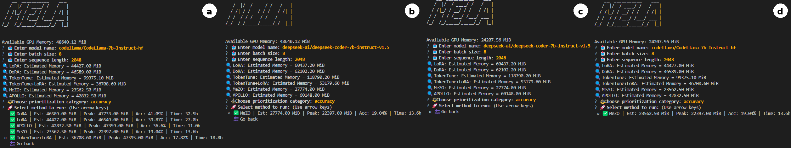

<p align="center">
  
</p>


<div align="center"><h1>&nbsp;AAMLA: An Autonomous Agentic Framework for Memory-Aware LLM-Aided Hardware Generation</h1></div>


<p align="center">
 <a href="https://www.techrxiv.org/doi/full/10.36227/techrxiv.175393689.97544984"><b>Preprint</b></a> 
</p>

## Contents
- [News](#news)
- [Introduction](#introduction)
- [Working_with_AAMLA](#Working_with_AAMLA)
- [Installation](#installation)
- [Usage](#usage)
- [Citation](#citation)

## News
- [2025/07] AAMLA preprint is released.
- [2025/10] AAMLA is accepted at VLSID 2026.

## Introduction

### AAMLA: An Autonomous Agentic Framework for Memory-Aware LLM-Aided Hardware Generation

This repository accompanies the paper **“AAMLA: An Autonomous Agentic Framework for Memory-Aware LLM-Aided Hardware Generation,”** accepted at **VLSID 2026**. AAMLA is a novel framework that enables hardware designers to fine-tune LLMs on domain-specific hardware corpora while avoiding Out-of-Memory (OoM) failures on commodity GPUs. AAMLA supports a diverse suite of parameter- and memory-efficient fine-tuning techniques, automatically estimates memory requirements for a given model–dataset–method combination, and adaptively selects feasible configurations to ensure reliable, low-latency fine-tuning even under tight hardware budgets.

## Working_with_AAMLA

### 1. Environment Setup

```bash
conda create -n aamla python=3.10
conda activate aamla
pip install torch==2.6.0
```

Clone repository:

```bash
git clone https://github.com/rajatbh21/AAMLA.git
cd AAMLA
pip install -r requirements.txt
```

---

### 2. pass@k Tools (Optional)

```bash
sudo apt-get install -y jq bc
```

---

### 3. VCS Installation (for Verilog Testing)

1. Obtain from Synopsys  
2. Install + license  
3. Add to PATH  
4. Validate with:

```bash
vcs -ID
```

---

# Usage

Run AAMLA:

```bash
python aamla.py
```



You will interactively select:

- Model (HuggingFace)
- Batch size / Sequence length
- Memory‑efficient fine‑tuning scheme  
- Priority: **Accuracy** or **Latency**  

Training + hardware generation starts automatically.

---

# Features

- Memory‑efficient LLM FT (MeZO, LoRA, LLMem++)
- Autonomous approximate computing search
- RTL generation + functional verification
- PPA estimation (area, power, delay)
- pass@k scoring for code quality
- End‑to‑end hardware design automation
