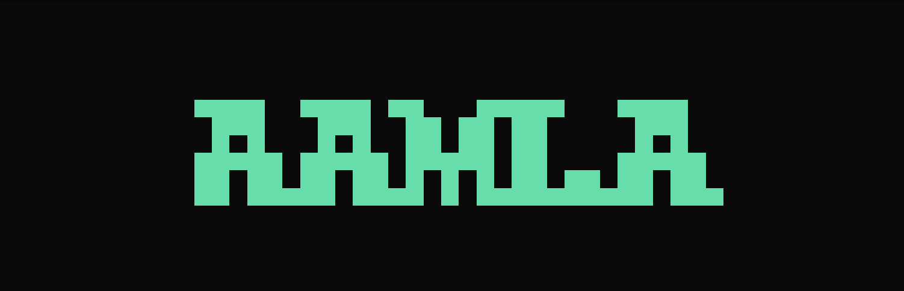

<p align="center">
  
</p>


<div align="center"><h1>&nbsp;AAMLA: An Autonomous Agentic Framework for Memory-Aware LLM-Aided Hardware Generation</h1></div>


<p align="center">
 <a href="https://www.techrxiv.org/doi/full/10.36227/techrxiv.175393689.97544984"><b>Preprint</b></a> 
</p>

## Contents
- [News](#news)
- [Introduction](#introduction)
- [Working_with_AAMLA](#Working_with_AAMLA)
- [Usage](#usage)
- [Description](#description)
- [Dataset](#dataset)
- [Citation](#citation)

## News
- [2025/07] AAMLA preprint is released.
- [2025/10] AAMLA is accepted at VLSID 2026.

## Introduction

### AAMLA: An Autonomous Agentic Framework for Memory-Aware LLM-Aided Hardware Generation

This repository accompanies the paper **“AAMLA: An Autonomous Agentic Framework for Memory-Aware LLM-Aided Hardware Generation,”** accepted at **VLSID 2026**. AAMLA is a novel framework that enables hardware designers to fine-tune LLMs on domain-specific hardware corpora while avoiding Out-of-Memory (OoM) failures on commodity GPUs. AAMLA supports a diverse suite of parameter- and memory-efficient fine-tuning techniques, automatically estimates memory requirements for a given model–dataset–method combination, and adaptively selects feasible configurations to ensure reliable, low-latency fine-tuning even under tight hardware budgets.

## Working_with_AAMLA

### 1. Environment Setup

```bash
conda create -n aamla python=3.10
conda activate aamla
pip install torch==2.6.0
```

### 2. Clone repository:

```bash
git clone https://github.com/rajatbh21/AAMLA.git
cd AAMLA
pip install -r requirements.txt
```

### 3. pass@k Tools (Optional)

```bash
sudo apt-get install -y jq bc
```

---

### 3. VCS Installation (for Verilog Testing)

VCS is a Verilog compiler required for automated testing on benchmarks. Follow these steps to install and configure VCS:
1. Obtain VCS from Synopsys. Ensure you have the required license to use it.
2. Install VCS following the instructions provided in the official Synopsys documentation.
3. Add the VCS executable to your system's PATH environment variable.


Verify the installation by running:
```bash
vcs -help
```

---

## Usage

Run AAMLA:

```bash
python aamla.py
```
You will interactively select:

- Model (HuggingFace name or local path)

- Batch size / Sequence length

- Priority: Accuracy or Time/Latency

- A feasible memory-aware fine-tuning scheme (you are welcome to add more)

- The job starts once a method that fits your GPU memory is selected.

You can also run with a fixed prioritization:

```bash
# Prioritize accuracy
python aamla.py -acc

# Prioritize time / latency
python aamla.py -time
```
After fine-tuning, aamla.py can:

📈 Measure pass@k on Verilog benchmarks (VerilogEval).

💬 Run chat inference for quick qualitative inspection.

## Description

**aamla.py** is the main agentic controller for AAMLA. It provides an interactive CLI that:

Estimates peak GPU memory for multiple fine-tuning strategies using LLMem++.

Filters out configurations that would trigger Out-of-Memory (OoM) on the current GPU.

Ranks feasible methods by accuracy or training time using offline profiles.

Launches the selected fine-tuning pipeline via the appropriate backend (LLaMA-Factory, MeZO, TokenTune, APOLLO).

Optionally runs VerilogEval pass@k evaluation.

Supports a lightweight chat-style inference interface on the trained model.

AAMLA currently reasons over the following method–adapter combinations:

**fft + lora**

Full Fine-Tuning (all base model weights updated) with LoRA adapters enabled. This hybrid configuration provides strong task adaptation but with higher memory usage.

**fft + dora**

Full fine-tuning with DoRA adapters, which decompose weights into direction and magnitude for potentially more stable and expressive updates.

**tokentune + none**

TokenTune without adapters. Learns a compact set of task-critical tokens, offering extremely low memory overhead.

**tokentune + lora**

TokenTune combined with LoRA, adding representational capacity while remaining memory-efficient.

**mezo + none**

MeZO (Memory-Zero) optimizer. Performs training without storing gradients, enabling highly memory-efficient full-model updates.

**apollo + none**

APOLLO optimizer (SGD-like memory, AdamW-level performance) for full-model fine-tuning without adapters.

Each configuration has an offline accuracy/time profile and an online memory estimate, allowing aamla.py to recommend only those strategies that fit within available GPU VRAM and match the user’s priority.

---

## Dataset

For dataset, we took the [HaVen-KL-Dataset](https://huggingface.co/datasets/yangyiyao/HaVen-KL-Dataset). However, the dataset is configurable, and AAMLA can be used with any hardware-oriented code dataset. AAMLA's capabilities extend beyond hardware generation for memory-efficient fine-tuning workflows.

## Citation
If you find AAMLA useful in your research, please cite:

```
 @article{Bhattacharjya_2025,
title={AAMLA: An Autonomous Agentic Framework for Memory-Aware LLM-Aided Hardware Generation},
url={http://dx.doi.org/10.36227/techrxiv.175393689.97544984/v1},
DOI={10.36227/techrxiv.175393689.97544984/v1},
publisher={Institute of Electrical and Electronics Engineers (IEEE)},
author={Bhattacharjya, Rajat and Sung, Juhee and Jung, Hangyeol and Oh, Hyunwoo and Sarkar, Arnab and Imani, Mohsen and Dutt, Nikil},
year={2025},
month=jul }

```
AAMLA is licensed under [MIT License](). For questions or issues, feel free to open an issue or contact the authors. Thank you for using AAMLA!
